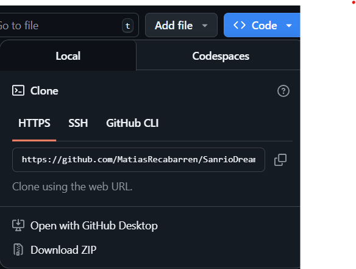

<!-->

# Página Web de SanrioDreams

## Nuestra página:
Sanrio Dreams es una tienda online especializada en productos originales de la reconocida marca Sanrio. Nacemos con el propósito de ofrecer una alternativa accesible, confiable y temática para los fanáticos, frente a los altos precios y baja disponibilidad en el mercado actual. Nuestra misión es entregar una experiencia de compra segura, rápida y encantadora, con un catálogo actualizado, atención personalizada y envíos a todo Chile. Además, buscamos formar una comunidad de clientes fieles que compartan su pasión por el mundo de Sanrio. Más que una tienda, somos un espacio pensado para fans, donde cada compra se convierte en parte de una experiencia única.

# Instalación

## Link Repositorio

Repositorio SanrioDreams: [https://github.com/MatiasRecabarren/SanrioDreams.git](https://github.com/MatiasRecabarren/SanrioDreams.git) 

## 1. Ir al repositorio de SanrioDreams
*Descargar archivo ZIP o Abrir con GitHub Desktop.*  

Si la descarga es en archivo **ZIP**, hay que descomprimirlo y abrirlo con Visual Studio Code. Dentro de Visual, buscar la opción **File**, luego **Open Folder** y seleccionar la carpeta ya descomprimida.

## 2. Instalación Requerimientos

*Ya dentro de Visual Studio Code, abriremos la consola con **CTRL + SHIFT + Ñ** o buscando la opción **Terminal** y **New Terminal**. Ahí escogeremos la que dice **Command Prompt*.**

Dentro de la consola ejecutaremos **venv\Scripts\activate** para activar el entorno virtual del proyecto. Posteriormente usaremos **pip install -r requirements.txt** para instalar los requerimientos del proyecto, en caso de no tenerlos.

## 3. Entrar a Página Web

*Dentro de la consola*

Ahora usaremos **python manage.py runserver**, lo que hará que nos aparezca un enlace que podremos copiar y pegar en el navegador web o usar **CTRL + Click Izquierdo** sobre el link para abrir la página.

## 4. Disfrutar de todo lo que ofrece la página

Dentro de la página habrá muchos artículos de la cadena Sanrio con los que podrás identificarte y elegir el que más te gusta en base a tu personalidad y preferencias.

<!-->